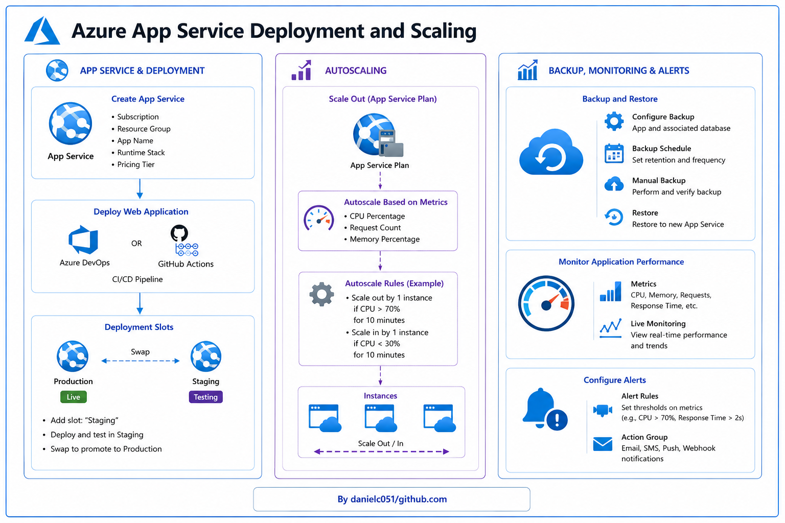

# 🚀 Azure App Service Deployment and Scaling

**Topics Covered:** Azure App Service, Deployment Slots, CI/CD, Autoscaling, Backup and Restore, Monitoring, Alerts

---

  

---

## 📖 Summary

This project focuses on deploying and managing a web application using Azure App Service. It demonstrates how to deploy applications through CI/CD pipelines, use deployment slots for safe releases, configure autoscaling to handle varying workloads, implement backup and recovery strategies, and monitor application performance with alerts.

---

## 🏢 Scenario

A company wants to deploy a web application using Azure App Service, validate new releases before production deployment, automatically scale resources based on demand, ensure application data can be recovered in the event of failure, and proactively monitor application health.

---

## 🛠️ Steps

### 1️⃣ 🌐 Create an Azure App Service

- Navigate to **App Services** → **Create**.
- Configure the following settings:
  - Subscription
  - Resource Group
  - App Service Name
  - Publish: **Code**
  - Runtime Stack (e.g., .NET, Node.js, Python)
  - Operating System
  - Region
- Select an appropriate **App Service Plan** pricing tier.
- Review and create the App Service.
- Verify that the web app has been successfully provisioned.

---

### 2️⃣ 🚀 Deploy the Web Application

- Set up a CI/CD pipeline using:
  - **GitHub Actions**, or
  - **Azure DevOps Pipelines**
- Connect the source code repository.
- Configure automatic deployments to the App Service.
- Trigger a deployment.
- Verify the application is accessible through the App Service URL.

---

### 3️⃣ 🔄 Configure Deployment Slots

- Navigate to **App Service** → **Deployment Slots**.
- Select **Add Slot**.
- Create a new slot named **Staging**.
- Clone configuration settings from the production slot.
- Deploy an updated version of the application to the Staging slot.
- Test functionality in the staging environment.
- Perform a **Swap** operation:
  - Staging → Production
- Verify the new version is live in production.

---

### 4️⃣ 📈 Configure Autoscaling

- Navigate to the **App Service Plan**.
- Select **Scale Out (App Service Plan)**.
- Enable **Custom Autoscale**.
- Configure scaling rules:
  - Scale out by 1 instance when CPU usage exceeds 70% for 10 minutes.
  - Scale in by 1 instance when CPU usage falls below 30% for 10 minutes.
- Set:
  - Minimum instances: 1
  - Maximum instances: 5
  - Default instances: 2
- Save and validate autoscale settings.

---

### 5️⃣ 💾 Configure Backup and Restore

- Navigate to **App Service** → **Backups**.
- Select **Configure**.
- Create a storage account for backup storage if required.
- Configure:
  - Scheduled backups
  - Backup retention policy
  - Associated databases
- Run a manual backup.
- Verify backup completion.
- Perform a restore:
  - Restore to a new App Service instance
  - Validate application functionality after recovery.

---

### 6️⃣ 📊 Monitor Application Performance

- Navigate to **App Service** → **Monitoring** → **Metrics**.
- Review key metrics:
  - CPU Percentage
  - Memory Working Set
  - Requests
  - Average Response Time
  - HTTP Server Errors
- Pin important metrics to an Azure Dashboard.
- Analyze performance trends and resource utilization.

---

### 7️⃣ 🚨 Configure Alerts

- Navigate to **Monitoring** → **Alerts**.
- Select **Create Alert Rule**.
- Configure conditions such as:
  - CPU Usage > 80%
  - Response Time > 2 seconds
  - HTTP 5xx Errors > 5
- Create an **Action Group**:
  - Email notifications
  - SMS notifications
  - Azure Functions or Logic Apps
- Save and test the alert configuration.

---

## 🎯 Learning Outcomes

By completing this project, you will be able to:

- Deploy web applications using Azure App Service
- Implement CI/CD pipelines with GitHub Actions or Azure DevOps
- Use deployment slots for safe application releases
- Perform slot swaps between staging and production environments
- Configure autoscaling based on application demand
- Implement backup and recovery strategies
- Restore applications from backups
- Monitor application performance using Azure Monitor
- Create alerts for proactive issue detection
- Manage highly available and scalable web applications in Azure

---

## ✅ Services Used

- Azure App Service
- App Service Plan
- Deployment Slots
- Azure Monitor
- Azure Alerts
- Azure Storage Account
- GitHub Actions / Azure DevOps

---

## 📚 Key Concepts

| Feature | Purpose |
|----------|----------|
| App Service | Host web applications without managing infrastructure |
| Deployment Slots | Test releases before production deployment |
| CI/CD | Automate build and deployment processes |
| Autoscaling | Dynamically adjust resources based on demand |
| Backup & Restore | Protect applications and recover from failures |
| Monitoring | Track application performance and health |
| Alerts | Notify administrators of critical events |

This project provides hands-on experience with deploying, scaling, monitoring, and protecting production-ready applications in Azure.